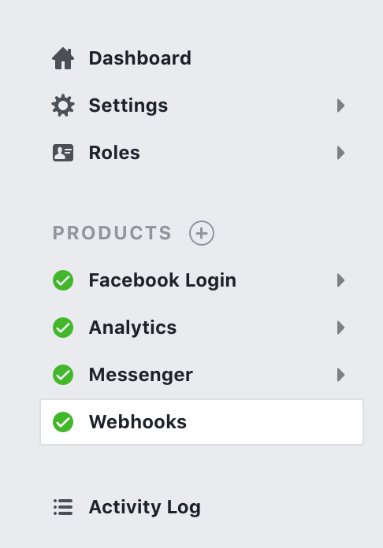
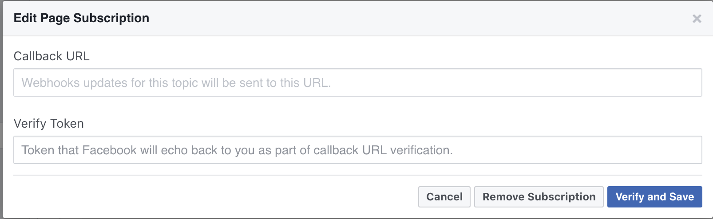

# py-facebook-webhook
[](https://www.python.org/downloads/)
[](https://opensource.org/licenses/MIT)
[](https://travis-ci.org/yc0/py-facebook-webhook)

A basic scaffold for Facebook messenger bot in Sanic : Async web server that's written to go fast

Sanic is very **high performance** JSON serialization, so it is very suitable for facebook webhook. Please refer the benchmark and related test source codes 
[Techempower](https://www.techempower.com/benchmarks/#section=data-r15&hw=ph&test=json)

## Get Started

Steps to get up and running:

- Create a new facebook App .https://developers.facebook.com/quickstarts/?platform=web

- Create a new facebook Page https://www.facebook.com/pages/create

- Go to your app and to the messengers tab on the sidebar

- Generate a token for your page. 

- Edit your webhook configuration
  
  
  > **Verify Token** is any string you like to help your webhook app confirm or authenticate the source.

## Run your webhook

I adopt environment variables to inject the PAGE_TOKEN and VERIFY_TOKEN for security, and easy to port on the docker environment.


```
$ pip install -r requirment.txt
$ VERIFY_TOKEN=<your verfiy token> PAGE_ACCESS_TOKEN=<your page token> python -m app.py 
```

the module support 5 parameters for non web server like gunicorn or nginx. Since the webhook in Facebook needs SSL, you must run with CERT.


--host 
-p, --port the app running port.
-d, --debug enable debug mode.
--cert, put your cert, 
--key, your cert passphrase.


## benchmark
https://blog.signifai.io/not-your-fathers-python-amazing-powerful-frameworks/